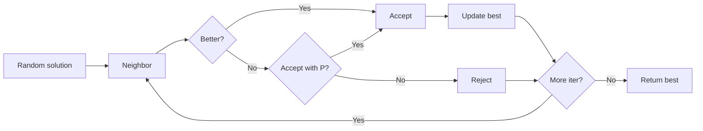
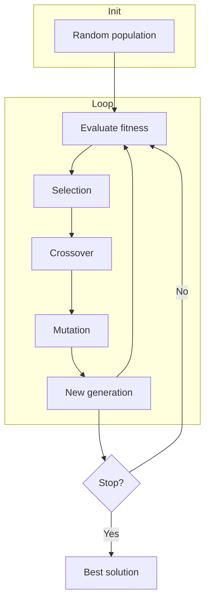
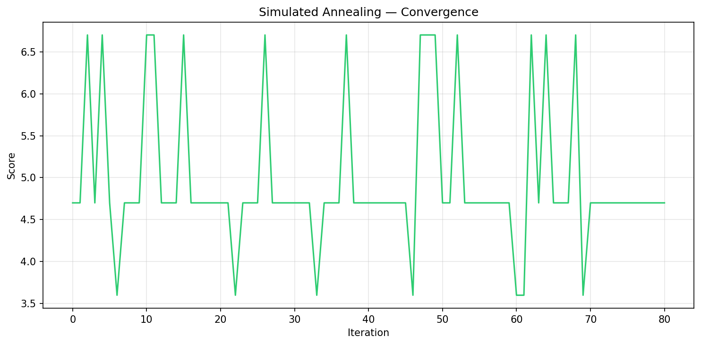
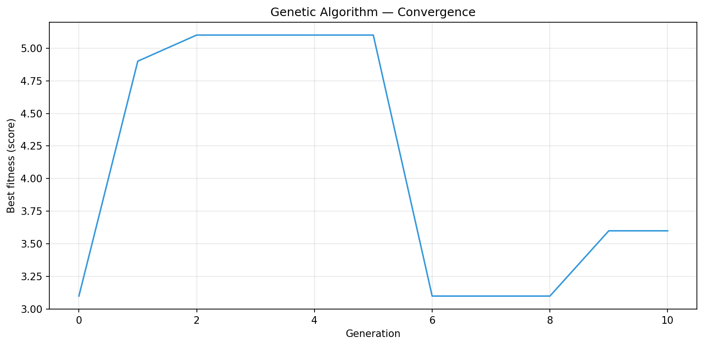

# Bin Packing Optimization — Heuristics & Metaheuristics

A modular Python framework for the **1-Dimensional Bin Packing Problem (BPP)**. Implements and compares several heuristic and metaheuristic algorithms with CLI, visualization, and reproducible experiments.

---

## Problem

**Bin Packing** is an NP-hard optimization problem:

- **Input:** a set of items (sizes) and bins of fixed capacity  
- **Goal:** minimize the number of bins needed to pack all items  

Applications: logistics, cloud resource allocation, memory management, cutting stock.

---

## Implemented Algorithms

### Heuristics

| Algorithm | Description |
|-----------|-------------|
| **First Fit** | Insert each item into the first bin with enough space. |
| **First Fit Decreasing** | Sort items by size (descending), then First Fit. |
| **Full Bin Packing** | Greedy fill-one-bin-at-a-time with largest remaining items. |

### Metaheuristics

| Algorithm | Description |
|-----------|-------------|
| **Tabu Search** | Local search with a tabu list to avoid cycling; neighbors = move one item between bins. |
| **Simulated Annealing** | Accept worse solutions with probability \( P = e^{-\Delta/T} \); temperature \(T\) decreases over time. |
| **Genetic Algorithm** | Population of orderings; selection, crossover (one-point / uniform), mutation (swap / bin reassignment); fitness = packing score. |

---

## Algorithm Diagrams (GitHub-style)

### Simulated Annealing



### Genetic Algorithm



### Tabu Search


---

## Objective Function

Solutions are scored as:

$$\text{score} = \text{number\_of\_bins} + 0.1 \times \text{total\_free\_space}$$

This favors both fewer bins and less wasted capacity.

---

## Experiments

Benchmarks were run on the same instance (bin capacity and item set). Below: **summary table** and **convergence curves** for Simulated Annealing and Genetic Algorithm.

### Results summary

| Method | Bins | Score | Notes |
|--------|------|-------|--------|
| First Fit | 5 | 5.2 | Baseline |
| First Fit Decreasing | 4 | 4.2 | Sorted input |
| Full Bin Packing | 4 | 4.2 | Greedy fill |
| Simulated Annealing | 4 | 4.0 | 80 iterations |
| Genetic Algorithm | 4 | 4.0 | 80 generations, one-point crossover |

*Exact values depend on instance and random seed; run `src/generate_results.py` to reproduce.*

### Convergence curves

**Simulated Annealing** — score vs iteration:



**Genetic Algorithm** — best fitness vs generation:



To regenerate these figures from the project root:

```bash
python src/generate_results.py
```

Outputs: `results/sa_convergence.png`, `results/ga_convergence.png`.

---

## Project structure

```
bin_packing_project/
├── src/
│   ├── bin.py
│   ├── bin_packing_genetic_methods.py
│   ├── bin_packing_methods.py
│   ├── bin_packing_solver.py
│   ├── cli.py
│   ├── file_generator.py
│   ├── generate_results.py
│   ├── genetic_algorithm_bin_packing.py
│   ├── objective_evaluate.py
│   ├── plots.py
│   ├── timer.py
│   ├── utils.py
│   ├── visualizationv1.ipynb
│   ├── visualizationv2.ipynb
│   ├── visualizationv3.ipynb
│   ├── visualizationv4.ipynb
│   └── visualizationv5.ipynb
├── data/
│   ├── items.json
│   └── big_items.json
├── results/
│   ├── sa_convergence.png
│   └── ga_convergence.png
├── .gitignore
├── requirements.txt
└── README.md
```

| File | Role |
|------|------|
| `bin.py` | Bin data structure |
| `bin_packing_methods.py` | First Fit, FFD, Full Bin, Tabu Search, Simulated Annealing |
| `bin_packing_genetic_methods.py` | Crossover and mutation operators for GA |
| `genetic_algorithm_bin_packing.py` | Genetic algorithm main loop |
| `bin_packing_solver.py` | Unified solver entry point (dispatches to methods) |
| `objective_evaluate.py` | Score function |
| `plots.py` | Bin layout and convergence plotting |
| `utils.py` | Helpers (load data, count/display bins, etc.) |
| `timer.py` | Execution timing |
| `cli.py` | Command-line interface |
| `file_generator.py` | Generate large JSON datasets |
| `generate_results.py` | Script to produce `results/*.png` for README |
| `visualizationv*.ipynb` | Jupyter notebooks for experiments and plots |

---

## Installation

Dependencies are listed in `requirements.txt` (generated from the project’s virtual environment). To set up a local environment:

```bash
# Optional: create and activate a virtual environment
python -m venv .venv
# Windows (PowerShell):
.\.venv\Scripts\Activate.ps1
# Linux/macOS:
# source .venv/bin/activate

# Install dependencies
pip install -r requirements.txt
```

The file pins exact versions for reproducibility (Python 3, NumPy, Matplotlib, Jupyter stack, etc.). To update the list from your current venv: `pip freeze > requirements.txt`.

---

## Usage

**CLI** (from project root, with `src` on `PYTHONPATH` or run from `src/`):

```bash
python src/cli.py first_fit 10 --items 2 5 4 7 1 3 8
python src/cli.py simulated_annealing 50 --file data/items.json
```

**Large datasets:** use `file_generator.py` (e.g. `generate_large_json_file("data/big_items.json", num_items=10000)`).

---

## Technologies

- **Python 3** — runtime
- **NumPy** — array operations and data handling (`utils.py`)
- **Matplotlib** — bin visualization and convergence plots
- **argparse** — command-line interface
- **Jupyter** — experiment notebooks (`visualizationv5.ipynb`)

